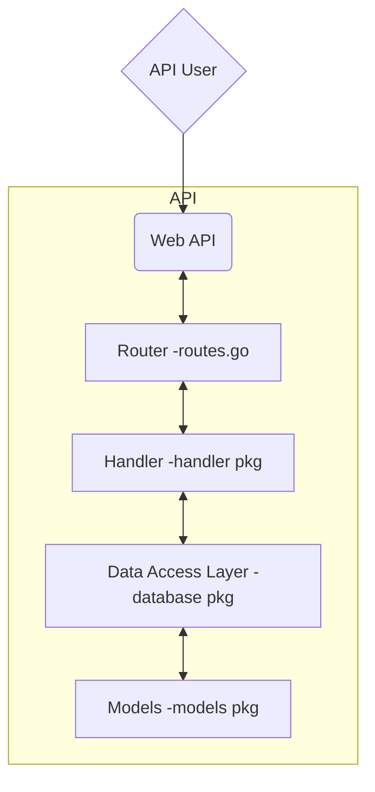

## Code Path

### Example code path
Request Skill by Id `/skill/1`: `main.go` --> `router.go` --> `handler/skills.go` --> `database/skills.go` --> `models/skill.go`

## Authentication
TO DO: Add Authentication diagram for create user, create API key, & login.
