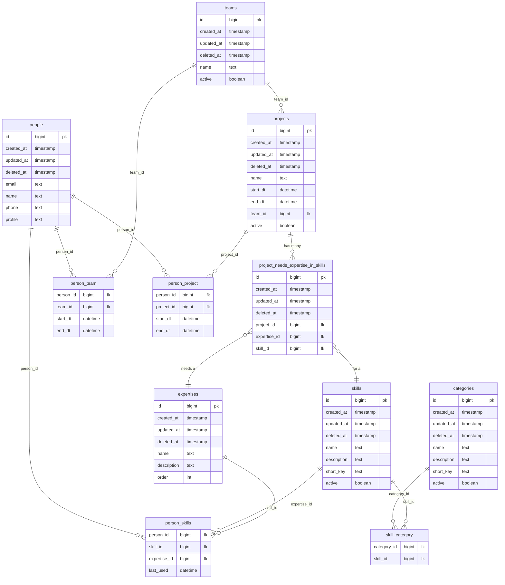

# Skill API Model Information
The purpose of this document is to describe the model used in this project and how they relate to eachother.

## Major Entities
The "major entities" in this project are:
* Skills: A skill that a person can have
* Person: A person who has skills
* Project: A proejct that a person applied a skill

## Supporting entities
There are supporting entities that provide context around the relationships of the major entities. These are:
* Categories: A classifiction level for skills to help organize
* Team: A grouping of persons during  aperiod of time
* Expertise: A scale that relates to a persons expierence in a skill

## Additional entities
TDB

## Entity Relationship Diagram (ERD)
The following ERD describes the current design of the database for the API

